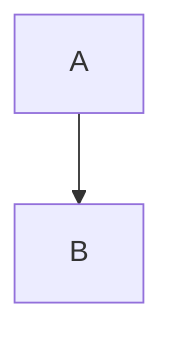

# Compatibilidade entre Plataformas Markdown

> **Referência avançada de**: markdown-fundamentals
> **Tópico**: CommonMark vs GFM vs GitLab vs Bitbucket vs Docs Sites, Gotchas

---

## Overview

Não existe um único "padrão" de Markdown universalmente implementado. O CommonMark define a base, mas cada plataforma adiciona extensões ou interpreta regras de forma diferente. Conhecer as diferenças evita problemas de renderização quando o mesmo documento é visualizado em plataformas distintas.

---

## CommonMark — A Base

O [CommonMark](https://spec.commonmark.org/) é a especificação mais rigorosa e unificada de Markdown. Ele define o comportamento esperado para a maioria dos elementos básicos.

### O Que o CommonMark Suporta

```markdown
<!-- ✅ Elementos do CommonMark (funcionam em praticamente todas as plataformas) -->

# Headings (H1-H6)

**negrito** e *itálico* e ***ambos***

- Listas não ordenadas
  - Com aninhamento

1. Listas ordenadas

[Links](https://exemplo.com)


> Blockquotes

`código inline`

```linguagem
blocos de código cercados
```

---   <!-- quebra horizontal -->
```

### O Que o CommonMark NÃO Suporta

```markdown
<!-- ❌ Extensões fora do CommonMark -->

| Tabelas | não são parte do CommonMark |
|---------|----------------------------|

- [x] Task lists não são CommonMark

~~strikethrough~~ não é CommonMark

Footnotes[^1] não são CommonMark

[^1]: Esta footnote não funciona em CommonMark puro
```

---

## GitHub Flavored Markdown (GFM)

O GFM é a implementação mais popular e influente. Adiciona extensões importantes ao CommonMark.

### Extensões GFM

**Tabelas:**
```markdown
| Coluna A | Coluna B |
|----------|----------|
| dado     | dado     |
<!-- ✅ Funciona no GitHub -->
```

**Task Lists:**
```markdown
- [ ] Pendente
- [x] Concluído
<!-- ✅ Funciona no GitHub, interativo -->
```

**Strikethrough:**
```markdown
~~texto riscado~~
<!-- ✅ Funciona no GitHub -->
```

**Autolinks:**
```markdown
Visite https://exemplo.com diretamente.
<!-- ✅ GitHub reconhece URLs sem angle brackets -->
```

**Emoji Shortcodes:**
```markdown
:white_check_mark: Concluído
:x: Falhou
:rocket: Deploy
:bulb: Dica
<!-- ✅ Convertido em emoji no GitHub -->
```

**Menções e Referências:**
```markdown
Corrigido por @usuario em #42
Relacionado ao PR #123
<!-- ✅ Links automáticos no GitHub -->
```

**Mermaid (diagramas):**
````markdown

<!-- ✅ Renderiza diagrama no GitHub -->
````

### Alertas do GitHub (Sintaxe Exclusiva)

```markdown
> [!NOTE]
> Esta é uma nota informativa.

> [!TIP]
> Dica útil para o usuário.

> [!WARNING]
> Atenção: isto pode causar problemas.

> [!CAUTION]
> Cuidado com esta operação.

> [!IMPORTANT]
> Informação crítica que não deve ser ignorada.
```

**⚠️ Esta sintaxe é exclusiva do GitHub.** Não funciona no GitLab, Bitbucket ou sites de docs padrão. No GitLab, use admonitions do MkDocs ou blockquotes simples como alternativa.

---

## GitLab Markdown

O GitLab mantém compatibilidade forte com GFM mas adiciona suas próprias extensões.

### Semelhanças com GFM

```markdown
<!-- ✅ Funciona no GitLab (mesmo que GFM) -->
| Tabelas | ✅ |
|---------|:--:|

- [x] Task lists ✅

~~strikethrough~~ ✅


<!-- Mermaid nativo ✅ -->
```

### Extensões Específicas do GitLab

**Footnotes:**
```markdown
Texto com footnote.[^1]

[^1]: Definição da footnote.
<!-- ✅ Suportado no GitLab, não no GitHub padrão (agora suportado) -->
```

**Abreviações:**
```markdown
O HTML é usado em toda a web.

*[HTML]: HyperText Markup Language
<!-- ✅ GitLab expande a abreviação como tooltip -->
```

**Definition Lists:**
```markdown
Termo
: Definição do termo.

Outro Termo
: Definição de outro termo.
<!-- ✅ Suportado no GitLab -->
```

**Math/LaTeX:**
```markdown
Inline: $E = mc^2$

Bloco:
$$
\sum_{i=1}^{n} i = \frac{n(n+1)}{2}
$$
<!-- ✅ Renderiza fórmulas matemáticas no GitLab -->
```

### Gotcha: Heading Anchors com Acentos

```markdown
## Instalação e Configuração

<!-- GitHub gera: #instalação-e-configuração (mantém acentos) -->
<!-- GitLab gera: #instalacao-e-configuracao (remove acentos) -->

<!-- Para links seguros, use o caminho sem acentos -->
[ver instalação](#instalacao-e-configuracao)
```

---

## Bitbucket

O Bitbucket tem suporte mais limitado comparado ao GitHub e GitLab.

### O Que Funciona

```markdown
<!-- ✅ Suportado no Bitbucket -->
# Headings
**negrito** e *itálico*
- Listas
1. Ordenadas
[Links](url)

> Blockquotes
`código inline`
blocos cercados com linguagem
---
```

### O Que NÃO Funciona ou Funciona Diferente

```markdown
<!-- ❌ Não suportado ou suporte parcial no Bitbucket -->

<!-- Task lists: renderiza mas não é interativo -->
- [ ] Pendente
- [x] Concluído

<!-- Mermaid: não suportado nativamente -->
<!-- Alertas GitHub ([!NOTE]): não suportado -->
<!-- Footnotes: não suportado -->
<!-- Emoji shortcodes: não suportado -->
```

---

## Sites de Documentação

### MkDocs

O MkDocs com extensões Python-Markdown oferece funcionalidades extras:

**Admonitions (Boxes de Destaque):**
```markdown
!!! note "Título da Nota"
    Conteúdo da nota.
    Pode ter múltiplas linhas.

!!! warning "Atenção"
    Esta operação é irreversível.

!!! tip
    Dica sem título customizado.

<!-- Tipos disponíveis: note, abstract, info, tip, success, question, warning, failure, danger, bug, example, quote -->
```

**Números de Linha em Código:**
````markdown
```python linenums="1"
def exemplo():
    return "com números de linha"
```
````

**Destaque de Linhas:**
````markdown
```python hl_lines="2 4"
def exemplo():
    return "esta linha é destacada"   # linha 2
x = 10
y = x + 1                            # linha 4
```
````

### Docusaurus

**Admonitions com Sintaxe Diferente:**
```markdown
:::note
Isto é uma nota no Docusaurus.
:::

:::warning
Atenção a esta situação.
:::

:::tip Título Customizado
Dica com título personalizado.
:::

<!-- Tipos: note, tip, caution, danger, info -->
```

**Mermaid:** Suportado com plugin `@docusaurus/plugin-content-docs`.

---

## Tabela de Comparação Completa

| Recurso | CommonMark | GitHub | GitLab | Bitbucket | MkDocs | Docusaurus |
|---------|:----------:|:------:|:------:|:---------:|:------:|:----------:|
| Headings H1-H6 | ✅ | ✅ | ✅ | ✅ | ✅ | ✅ |
| Negrito/Itálico | ✅ | ✅ | ✅ | ✅ | ✅ | ✅ |
| Listas | ✅ | ✅ | ✅ | ✅ | ✅ | ✅ |
| Blocos de Código | ✅ | ✅ | ✅ | ✅ | ✅ | ✅ |
| Tabelas | ❌ | ✅ | ✅ | ✅ | ✅ | ✅ |
| Task Lists | ❌ | ✅ | ✅ | Parcial | ❌ | ❌ |
| Strikethrough | ❌ | ✅ | ✅ | ✅ | ✅ | ✅ |
| Mermaid | ❌ | ✅ | ✅ | ❌ | ✅ | ✅ |
| Footnotes | ❌ | ✅ | ✅ | ❌ | ✅ | ❌ |
| Alertas/Admonitions | ❌ | ✅* | ❌ | ❌ | ✅** | ✅*** |
| Emoji Shortcodes | ❌ | ✅ | ✅ | ❌ | ❌ | ❌ |
| Math/LaTeX | ❌ | ❌ | ✅ | ❌ | ✅ | ✅ |
| Front Matter YAML | ❌ | ❌ | ❌ | ❌ | ✅ | ✅ |
| Details/Summary | ❌ | ✅ | ✅ | ❌ | ✅ | ✅ |

*GitHub usa `[!NOTE]` no blockquote
**MkDocs usa `!!! note`
***Docusaurus usa `:::note`

---

## Gotchas Comuns

### 1. Alertas com Sintaxe Diferente por Plataforma

```markdown
<!-- GitHub -->
> [!NOTE]
> Nota no GitHub.

<!-- MkDocs -->
!!! note
    Nota no MkDocs.

<!-- Docusaurus -->
:::note
Nota no Docusaurus.
:::

<!-- Se precisa funcionar em múitas plataformas, use blockquote simples -->
> **Nota:** Informação importante.
```

### 2. Heading Anchors com Caracteres Especiais

```markdown
## C++ Tutorial

<!-- GitHub gera: #c-tutorial (remove +) -->
<!-- GitLab gera: #c-tutorial -->
<!-- Para links seguros, teste na plataforma alvo -->
[ver tutorial](#c-tutorial)
```

### 3. Indentação em Listas com Código

````markdown
<!-- ❌ Problema comum: indentação insuficiente -->
- Item
```bash
# Este bloco pode não estar dentro da lista
npm install
```

<!-- ✅ Correto: indentação adequada + linha em branco -->
- Item

  ```bash
  npm install
  ```
````

### 4. HTML e Mermaid em Plataformas Limitadas

```markdown
<!-- Se Mermaid não funciona, use imagens estáticas como fallback -->
<!-- Gere o diagrama localmente e insira como imagem -->

```

### 5. Tabelas com Caracteres Especiais

```markdown
<!-- Pipe (|) dentro de célula quebra a tabela -->
<!-- Use HTML entity ou escape -->
| Comando | Sintaxe |
|---------|---------|
| OR lógico | `a \|\| b` |
<!-- Ou use HTML: `a &#124;&#124; b` -->
```

---

## Estratégia de Compatibilidade Máxima

Para documentação que será visualizada em múltiplas plataformas:

### Base Segura (funciona em todas)
```markdown
- Headings, listas, negrito/itálico
- Links e imagens
- Blocos de código cercados com linguagem
- Blockquotes simples
- Quebra horizontal (---)
```

### Extensões Relativamente Seguras
```markdown
- Tabelas (GFM) — não funciona em CommonMark puro, mas funciona nas plataformas principais
- Strikethrough — amplo suporte
- Details/Summary — funciona onde HTML é permitido
```

### Evitar para Máxima Compatibilidade
```markdown
- Alertas [!NOTE] (GitHub exclusivo)
- Admonitions !!! (MkDocs exclusivo)
- Math/LaTeX (GitLab e docs sites apenas)
- Emoji shortcodes :emoji: (GitHub/GitLab apenas)
- Números de linha em código (docs sites apenas)
```

---

## Referências

- [CommonMark Spec](https://spec.commonmark.org/) — Especificação base
- [GFM Spec](https://github.github.com/gfm/) — Extensões do GitHub
- [GitLab Markdown](https://docs.gitlab.com/ee/user/markdown.html) — Documentação oficial GitLab
- [MkDocs Extensions](https://facelessuser.github.io/pymdown-extensions/) — Extensões Python-Markdown
- [Docusaurus MDX](https://docusaurus.io/docs/guides/docs/docs-create-doc#markdown-features) — Funcionalidades do Docusaurus
