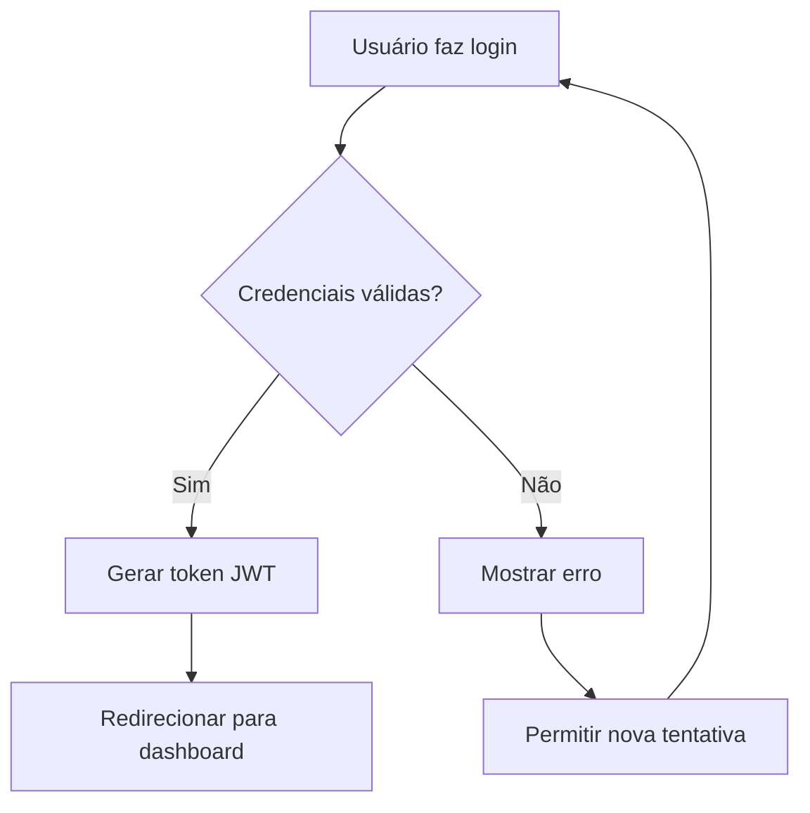
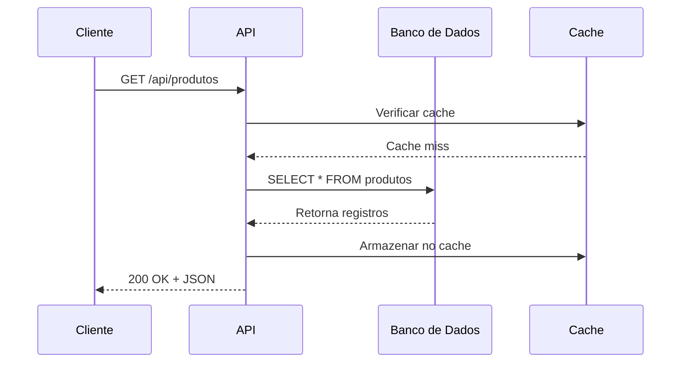
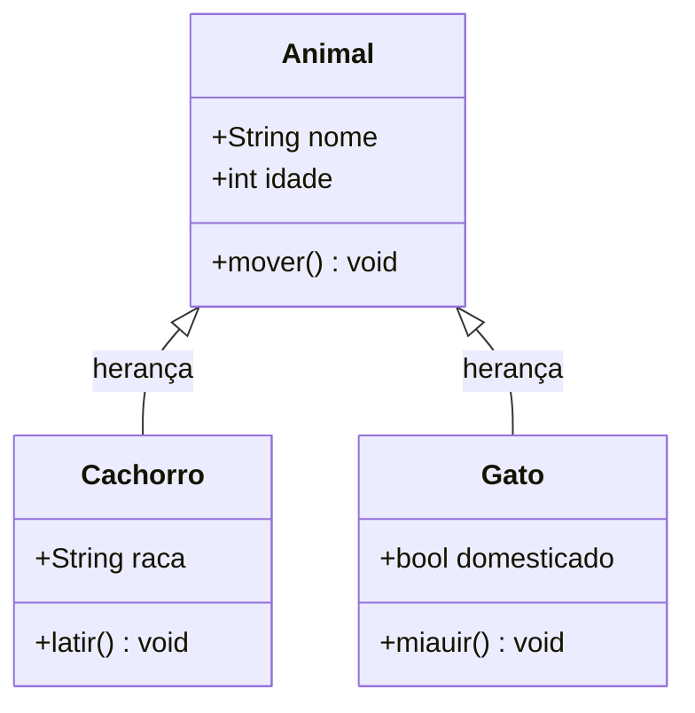
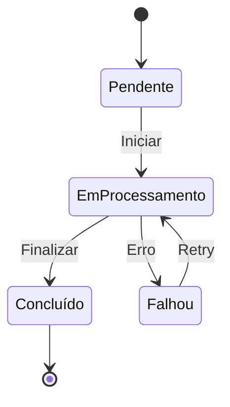
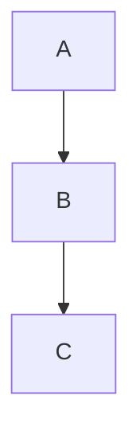

# Recursos Avançados em Markdown

> **Referência avançada de**: markdown-fundamentals
> **Tópico**: Blockquotes, HTML, Footnotes, Seções Colapsáveis, Mermaid, Front Matter YAML

---

## Overview

Além da sintaxe básica, o Markdown oferece recursos avançados que ampliam expressividade da documentação: blockquotes aninhados, HTML inline, footnotes, seções colapsáveis via `<details>`, diagramas com Mermaid e metadados via front matter YAML. Estes recursos aumentam a flexibilidade mas variam na compatibilidade entre plataformas.

---

## Blockquotes

### Básico

```markdown
> Esta é uma citação.
> Pode ter múltiplas linhas.
```

### Multi-Linha com Parágrafo

```markdown
> Primeiro parágrafo da citação.
>
> Segundo parágrafo da citação.
> Continua aqui.
```

### Blockquotes Aninhados

```markdown
> Citação de primeiro nível.
>
> > Citação de segundo nível (aninhada).
>
> Volta ao primeiro nível.
```

### Formatação Interna

Blockquotes suportam todos os elementos Markdown internamente:

```markdown
> ## Título dentro da citação
>
> - Item da lista
> - Outro item
>
> ```python
> print("código dentro da citação")
> ```
>
> **Negrito**, *itálico* e `código inline` funcionam.
```

### Uso como Admonition (Destaque)

Blockquotes são comumente usados para destacar informações importantes:

```markdown
> **Nota:** Lembre-se de exportar as variáveis de ambiente antes de executar.

> **Atenção:** Esta operação é irreversível. Faça um backup antes.

> **Dica:** Use `--verbose` para ver logs detalhados durante o debug.
```

**Nota:** Para admonitions formatados (com cores e ícones), consulte a referência de compatibilidade — GitHub usa sintaxe especial `[!NOTE]`, enquanto MkDocs usa `!!!`.

---

## HTML em Markdown

O Markdown permite inserir HTML diretamente quando a sintaxe nativa não é suficiente.

### Elementos Inline

```markdown
<!-- Sublinhado (não existe em Markdown nativo) -->
Use <u>esta parte</u> para destacar sem itálico.

<!-- Subscrito e superscrito -->
H<sub>2</sub>O é a fórmula da água.
E = mc<sup>2</sup> é a equação de Einstein.

<!-- Tecla de teclado -->
Pressione <kbd>Ctrl</kbd> + <kbd>S</kbd> para salvar.
```

### Imagens Redimensionadas

```markdown
<!-- Redimensionar imagem com HTML (não suportado em Markdown nativo) -->


<!-- Com ambas as dimensões -->


<!-- Centralizada -->
<div align="center">
  
</div>
```

### Comentários HTML

Comentários HTML não são renderizados — úteis para notas internas:

```markdown
<!-- TODO: atualizar esta seção quando a v2 for lançada -->
<!-- Autor: João Silva, 2026-02-05 -->

# Documentação do Projeto

<!-- NOTA INTERNA: esta seção precisa de revisão -->
## Instalação
```

### Quebras de Linha Forçadas

Três métodos para forçar quebra de linha:

```markdown
<!-- Método 1: dois espaços no final da linha -->
Primeira linha
Segunda linha

<!-- Método 2: tag <br> -->
Primeira linha<br>
Segunda linha

<!-- Método 3: barra invertida no final (GFM) -->
Primeira linha\
Segunda linha
```

### Limitações do HTML em Blocos

```markdown
<!-- ❌ CUIDADO: HTML em bloco pode causar problemas -->
<!-- A linha antes e depois deve estar em branco -->

<div class="custom-box">

Conteúdo Markdown **dentro** do div.

</div>

<!-- ❌ NÃO funciona: Markdown dentro de HTML sem linha em branco -->
<div>
**Isto pode não renderizar como negrito** em muitos renderizadores.
</div>
```

---

## Footnotes

Footnotes permitem adicionar notas complementares sem interromper o texto principal.

### Sintaxe Básica

```markdown
Este é um texto com uma nota.[^1]
Aqui está outra referência.[^nota-importante]

[^1]: Esta é a footnote número 1.
[^nota-importante]: Esta footnote usa um ID descritivo.
```

### Footnote Multi-Linha

```markdown
Consulte a documentação oficial.[^docs]

[^docs]: A documentação completa está disponível em
    https://docs.exemplo.com.
    Atualizada mensalmente pela equipe.
```

### Compatibilidade de Footnotes

| Plataforma | Suporta Footnotes |
|------------|:-----------------:|
| GitHub | ✅ |
| GitLab | ✅ |
| Bitbucket | ❌ |
| MkDocs | ✅ (com extensão) |
| CommonMark padrão | ❌ |

---

## Seções Colapsáveis

Seções colapsáveis usam os elementos HTML `<details>` e `<summary>`. Muito útil para ocultar conteúdo longo ou opcional.

### Básico

```markdown
<details>
<summary>Clique para ver mais</summary>

Este conteúdo está oculto por padrão.
Aparece quando o usuário clica no título.

</details>
```

### Exemplo: Instruções por Sistema Operacional

```markdown
<details>
<summary>Windows</summary>

1. Baixe o instalador em https://exemplo.com/download
2. Execute `installer.exe`
3. Siga as instruções na tela

</details>

<details>
<summary>macOS</summary>

1. Instale via Homebrew: `brew install pacote`
2. Configure: `pacote config init`

</details>

<details>
<summary>Linux</summary>

1. Adicione o repositório: `sudo add-apt-repository ppa:exemplo/pacote`
2. Instale: `sudo apt install pacote`

</details>
```

### Seção Aberta por Padrão

```markdown
<details open>
<summary>Configuração padrão (expandido por padrão)</summary>

Esta seção aparece aberta quando a página carrega.
Use o atributo `open` na tag `<details>`.

</details>
```

### Código dentro de Seções Colapsáveis

````markdown
<details>
<summary>Exemplo completo de código</summary>

```python
import asyncio

async def buscar_dados(url: str) -> dict:
    """Busca dados de uma API assíncrona."""
    async with aiohttp.ClientSession() as session:
        async with session.get(url) as response:
            return await response.json()

async def main():
    dados = await buscar_dados("https://api.exemplo.com/dados")
    print(dados)

asyncio.run(main())
```

</details>
````

---

## Diagramas com Mermaid

O Mermaid permite criar diagramas a partir de texto dentro de blocos de código `mermaid`. Suportado nativamente pelo GitHub, GitLab e muitos docs sites.

### Flowchart (Diagrama de Fluxo)

````markdown

````

### Diagrama de Sequência

````markdown

````

### Diagrama de Classe

````markdown

````

### Diagrama de Estado

````markdown

````

### Compatibilidade do Mermaid

| Plataforma | Mermaid Nativo | Configuração Extra |
|------------|:--------------:|:------------------:|
| GitHub | ✅ | Nenhuma |
| GitLab | ✅ | Nenhuma |
| MkDocs | ✅ | Extensão `mermaid` |
| Docusaurus | ✅ | Plugin `mermaid` |
| Bitbucket | ❌ | — |
| VS Code Preview | ❌ | Extensão necessária |

---

## Front Matter YAML

Front matter é um bloco YAML no início do documento, delimitado por `---`. Usado para metadados estruturados.

### Sintaxe

```markdown
---
titulo: "Guia de Instalação"
autor: "Maria Silva"
data: 2026-02-05
tags: [instalação, guia, quickstart]
versao: "2.1.0"
---

# Guia de Instalação

Conteúdo do documento começa aqui.
```

### Campos Comuns

```markdown
---
# Identificação
titulo: "Título do Documento"
descricao: "Resumo breve para SEO e listagens"

# Metadados
autor: "Nome do Autor"
data_criacao: 2026-02-05
data_atualizacao: 2026-02-05
versao: "1.0.0"

# Classificação
tags: [tag1, tag2, tag3]
categoria: "documentação"
status: "publicado"  # rascunho | em-revisão | publicado

# Navegação (Jekyll, Hugo, MkDocs)
nav_titulo: "Título na Sidebar"
nav_ordem: 3
ocultar_nav: false
---
```

### Compatibilidade do Front Matter

| Plataforma | Suporta Front Matter | Uso Principal |
|------------|:--------------------:|---------------|
| Jekyll | ✅ | Metadados de página |
| Hugo | ✅ | Configuração de página |
| MkDocs | ✅ | Metadados e navegação |
| Docusaurus | ✅ | Configuração de página |
| GitHub (README) | ❌ | Ignorado na renderização |
| GitLab | ❌ | Ignorado na renderização |

---

## Best Practices — Resumo

### Usar

```markdown
<!-- Blockquotes para destacar notas importantes -->
> **Nota:** Lembre-se de verificar as permissões.

<!-- Seções colapsáveis para conteúdo longo/opcional -->
<details>
<summary>Configuração avançada</summary>
...
</details>

<!-- Mermaid para diagramas simples e médios -->


<!-- Front matter quando a plataforma suporta -->
---
titulo: "Título"
tags: [tag1]
---
```

### Evitar

```markdown
<!-- Não use seções colapsáveis para informações críticas de segurança -->
<!-- O usuário pode não expandir e perder informação importante -->

<!-- Não crie diagramas Mermaid muito complexos em um único bloco -->
<!-- Se tem mais de 15 nós, divida em múltiplos diagramas -->

<!-- Não dependa de front matter em plataformas que não suportam -->
<!-- Verifique a compatibilidade da plataforma de destino -->
```

---

## Referências

- [GitHub Docs — Alerts](https://docs.github.com/en/get-started/writing-on-github/getting-started-with-writing-and-formatting-on-github/basic-writing-and-formatting-syntax#alerts) — Sintaxe de alertas GitHub
- [Mermaid JS — Documentação](https://mermaid.js.org/intro/) — Tipos de diagramas suportados
- [MkDocs — Admonitions](https://python-markdown.github.io/extensions/admonition/) — Extensão de admonitions
- [Jekyll — Front Matter](https://jekyllrb.com/docs/front-matter/) — Como Jekyll usa front matter
- [Hugo — Front Matter](https://gohugoio.com/docs/content-management/front-matter/) — Como Hugo usa front matter
