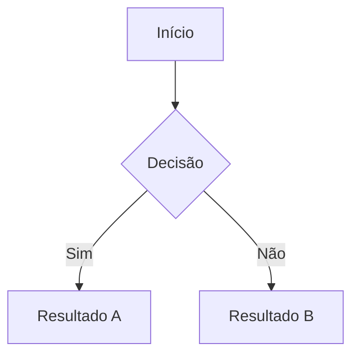
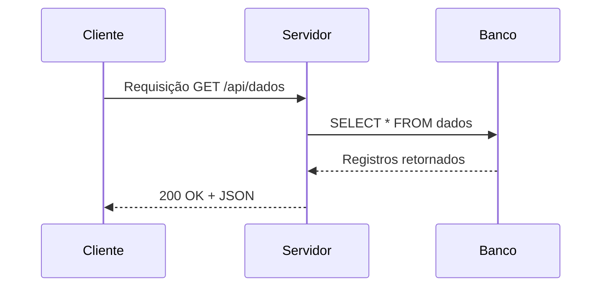

# Markdown Fundamentals

Skill para criação e manutenção de documentos Markdown seguindo especificações CommonMark, extensões GFM e boas práticas de compatibilidade entre plataformas. Cobre desde sintaxe básica até recursos avançados como tabelas, blocos de código, diagramas e seções colapsáveis, sem dependência de framework específico.

---

## When to Use

Use esta skill quando precisar:

- **Criar ou revisar documentação técnica** (READMEs, guias, wikis)
- **Escrever arquivos Markdown para repositórios** no GitHub, GitLab ou Bitbucket
- **Estruturar documentos com hierarquia de headings** clara e acessível
- **Usar tabelas, listas e blocos de código** formatados corretamente
- **Adicionar diagramas** via Mermaid em documentação
- **Garantir compatibilidade** entre diferentes renderizadores Markdown
- **Aplicar badges, links relativos e imagens** em documentação
- **Usar front matter YAML** em arquivos Markdown para metadados

**Não use para:** Criação de sites completos (Jekyll, Hugo), slides de apresentação, edição de formatos proprietários (Confluence XHTML, Word).

---

## Instructions

### Step 1: Analisar Contexto

Antes de criar ou revisar um documento Markdown, identifique:

1. **Plataforma de destino**
   - GitHub, GitLab, Bitbucket → suportam GFM com variações específicas
   - Sites de docs (MkDocs, Docusaurus, Hugo) → suportam extensões extras
   - Visualizador genérico → aderir ao CommonMark estrito

2. **Propósito do documento**
   - README de repositório → conciso, com badges e links de navegação
   - Documentação de API → estrutura detalhada, exemplos de código
   - Wiki interna → hierarquia profunda, cross-links entre páginas

3. **Convenções existentes no projeto**
   - Estilo de indentação (2 ou 4 espaços para listas aninhadas)
   - Uso de `---` vs `***` para quebras horizontais
   - Padrão de links (inline vs estilo referência)

### Step 2: Aplicar Estrutura Base

**Hierarquia de headings (H1–H6):**
```markdown
# Título Principal (H1) — apenas um por documento

## Seção Principal (H2)

### Subseção (H3)

#### Detalhe (H4) — usar com moderação
```

**Ênfase e formatação inline:**
```markdown
**texto em negrito**
*texto em itálico*
***texto negrito e itálico***
~~texto riscado~~          <!-- GFM apenas -->
`código inline`
```

**Listas básicas:**
```markdown
- Item não ordenado
- Outro item
  - Sub-item (indentado com 2 espaços)

1. Item ordenado
2. Segundo item
   1. Sub-item ordenado
```

**Links e quebra de linha:**
```markdown
[texto do link](https://exemplo.com)
[link com título](https://exemplo.com "Título ao hover")

Duas barras finais para quebra de linha  
ou uma linha em branco entre parágrafos.
```

### Step 3: Usar Recursos Avançados

**Blocos de código com realce de sintaxe:**
````markdown
```python
def saudacao(nome: str) -> str:
    return f"Olá, {nome}!"
```
````

**Tabelas (GFM):**
```markdown
| Coluna A | Coluna B | Coluna C |
|----------|:--------:|---------:|
| esquerda | centro   |  direita |
```

**Blocos de citação:**
```markdown
> Citação principal
>
> > Citação aninhada (dois níveis)
```

**Diagramas Mermaid (GitHub, GitLab, MkDocs):**
````markdown

````

**Seção colapsável (HTML em Markdown):**
```markdown
<details>
<summary>Clique para expandir</summary>

Conteúdo oculto por padrão.

</details>
```

### Step 4: Validar e Revisar

**Checklist Final:**
- [ ] Apenas um H1 no documento
- [ ] Hierarquia de headings sem saltos (H1 → H2 → H3, nunca H1 → H3)
- [ ] Todos os links funcionam (relativos e externos verificados)
- [ ] Blocos de código com linguagem especificada após as marcas cercadas
- [ ] Tabelas com alinhamento consistente e cabeçalho separador presente
- [ ] Sem caracteres especiais não escapados que quebrem a renderização
- [ ] Front matter YAML válido quando utilizado
- [ ] Compatível com a plataforma de destino (consulte compatibility.md)

---

## Referências JIT

Para tópicos avançados, consulte as referências detalhadas:

| Tópico | Arquivo | Conteúdo |
|--------|---------|----------|
| Hierarquia de Headings | [headings-structure.md](./references/headings-structure.md) | H1–H6, outline do documento, acessibilidade, SEO |
| Links e Imagens | [links-images.md](./references/links-images.md) | Links relativos, badges, estilo referência, imagens |
| Blocos de Código | [code-blocks.md](./references/code-blocks.md) | Inline, cercado, realce de sintaxe, diff, código em listas |
| Tabelas e Listas | [tables-lists.md](./references/tables-lists.md) | Listas ordenadas/não-ordenadas, tarefas GFM, tabelas complexas |
| Recursos Avançados | [advanced-features.md](./references/advanced-features.md) | Citações, HTML, footnotes, Mermaid, front matter YAML |
| Compatibilidade | [compatibility.md](./references/compatibility.md) | CommonMark vs GFM vs GitLab, gotchas por plataforma |

Estas referências são carregadas just-in-time quando necessário.

---

## Quick Examples

### README básico com badges e seções essenciais
```markdown
# Meu Projeto

[](LICENSE)
[](CHANGELOG.md)

Descrição breve do projeto em uma ou duas linhas.

## Instalação

```bash
pip install meu-projeto
```

## Uso básico

```python
from meu_projeto import principal
principal()
```
```

### Tabela de comparação com alinhamento misto
```markdown
| Recurso          | CommonMark | GFM    | GitLab MD |
|------------------|:----------:|:------:|:---------:|
| Headings         | Sim        | Sim    | Sim       |
| Tabelas          | Não        | Sim    | Sim       |
| Task Lists       | Não        | Sim    | Sim       |
| Mermaid          | Não        | Sim    | Sim       |
| Footnotes        | Não        | Não    | Sim       |
```

### Diagrama de sequência com Mermaid
````markdown

````

Para exemplos detalhados, consulte as **[referências JIT](#referências-jit)**.

---

## Compatibility

| CLI | Status | Notes |
|-----|--------|---------|
| Claude Code | Supported | Fully supported |
| Gemini CLI | Supported | Fully supported |
| OpenAI Codex | Supported | Fully supported |
| GitHub Copilot | Supported | Fully supported |
| OpenCode | Supported | Fully supported |
| Cursor | Supported | Fully supported |
| Qwen Code | Supported | Fully supported |

**Requires:**
- Acesso ao filesystem para ler e revisar documentos Markdown existentes
- Conhecimento da plataforma de destino (GitHub, GitLab, docs sites)

---

## Segurança

- Não executa código automaticamente
- Não acessa rede ou recursos externos
- Apenas leitura e análise/geração de texto Markdown
- Sugestões seguem princípios de segurança: não inclui credenciais, tokens ou secrets em exemplos
- Links externos em documentação devem ser verificados manualmente antes de publicar
- Front matter YAML não deve conter dados sensíveis; use variáveis de ambiente quando necessário
- Seções colapsáveis (`<details>`) não devem ser usadas para ocultar informações de segurança críticas

---

## Fontes

| Fonte | Tipo | URL |
|-------|------|-----|
| CommonMark Spec | Especificação | [spec.commonmark.org](https://spec.commonmark.org/) |
| GitHub Flavored Markdown | Oficial (GitHub) | [docs.github.com/en/get-started/writing-on-github](https://docs.github.com/en/get-started/writing-on-github/getting-started-with-writing-and-formatting-on-github) |
| GitLab Markdown | Oficial (GitLab) | [docs.gitlab.com/ee/user/markdown.html](https://docs.gitlab.com/ee/user/markdown.html) |
| Mermaid JS Docs | Oficial (Mermaid) | [mermaid.js.org](https://mermaid.js.org/) |
| W3C WCAG 2.1 | Padrão Acessibilidade | [w3.org/WAI/WCAG21/Overview](https://www.w3.org/WAI/WCAG21/Overview.html) |

---

**Version**: 1.0.0
**Created**: 2026-02-05
**License**: MIT
