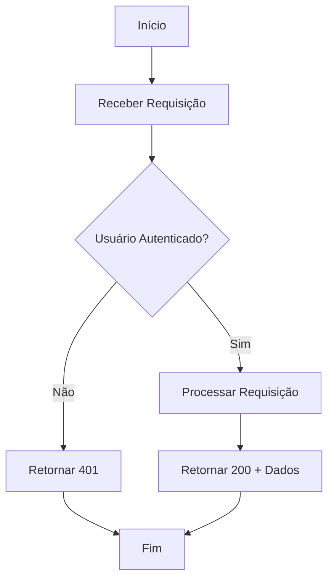
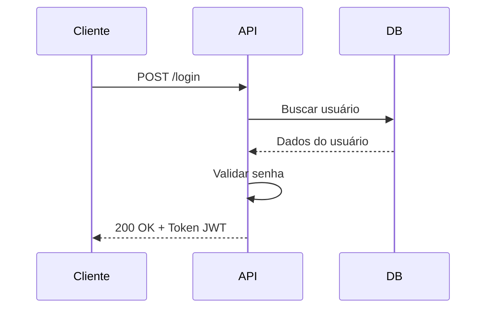
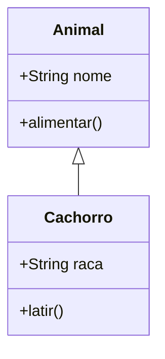
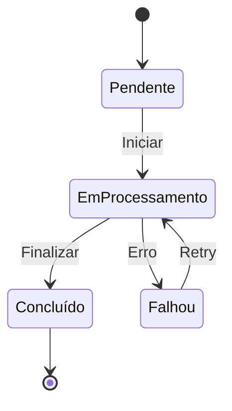

# Recursos Avançados em Markdown

> **Referência avançada de**: markdown-fundamentals
> **Tópico**: Blockquotes, HTML em Markdown, Footnotes, Abreviações, Seções Colapsáveis, Diagramas Mermaid, Front Matter YAML

---

## Overview

Além da sintaxe básica, o Markdown oferece recursos avançados que aumentam expressividade e funcionalidade da documentação. Alguns são parte do CommonMark, outros são extensões de plataformas específicas (GFM, GitLab, MkDocs). Este documento cobre cada recurso com exemplos práticos e indicação de compatibilidade.

---

## Blockquotes (Citações)

### Sintaxe Básica

```markdown
> Esta é uma citação.
```

### Blockquote Multi-Linha

```markdown
> Esta é uma citação que se estende
> por múltiplas linhas consecutivas.
> Todas as linhas começam com >.
```

### Blockquotes Aninhados

```markdown
> Nível 1: Citação principal
>
> > Nível 2: Citação dentro da citação
>
> > > Nível 3: Profundidade máxima recomendada
```

### Blockquote com Formatação Interna

```markdown
> **Nota importante:** Este método foi deprecado na versão 3.0.
>
> Use `novoMetodo()` ao invés de `metodoAntigo()`.
>
> Exemplo:
> ```javascript
> const resultado = novoMetodo(parametro);
> ```
```

### Blockquote como "Admonition" (Aviso)

Blockquotes com negrito no início funcionam como avisos simples portáveis:

```markdown
> **Nota:** Informação adicional sobre o tema.
> **Atenção:** Comportamento pode variar entre versões.
> **Dica:** Use esta abordagem para melhor performance.
```

**Compatibilidade:** GitHub e GitLab renderizam blockquotes. MkDocs com extensão `admonition` oferece suporte com cores via sintaxe `!!!`.

---

## HTML em Markdown

O Markdown permite HTML inline e em blocos. Útil quando a sintaxe Markdown pura não oferece o que você precisa.

### Elementos Inline

```markdown
Texto com <strong>negrito HTML</strong> e <em>itálico HTML</em>.

Texto com quebra de linha:<br>Nova linha sem novo parágrafo.

Texto com <sub>subscrito</sub> e <sup>superscrito</sup>.

Texto com <kbd>Ctrl</kbd> + <kbd>C</kbd> para copiar.
```

### Imagens Redimensionadas (GitHub/GitLab)

```markdown
<!-- GitHub aceita atributos width/height em img HTML -->


<!-- Comparação: sintaxe Markdown padrão não suporta redimensionamento -->
<!--  <!-- sem controle de tamanho --> -->
```

### Comentários HTML

Comentários HTML são ignorados na renderização — útil para notas internas:

```markdown
<!-- TODO: Atualizar esta seção após o lançamento da v2.0 -->

<!--
  NOTA INTERNA:
  Este documento foi criado em 2026-02-05.
  Revisar trimestralmente.
-->

# Título Visível

Conteúdo público aqui.
```

### Quebras de Linha Forçadas

```markdown
<!-- Método 1: dois espaços no final da linha -->
Primeira linha
Segunda linha

<!-- Método 2: tag <br> HTML -->
Primeira linha<br>
Segunda linha

<!-- Método 3: barra invertida no final (GFM) -->
Primeira linha\
Segunda linha
```

### Limitações do HTML em Markdown

```markdown
<!-- HTML em blocos requer linha em branco antes e depois -->

<div style="background: #f0f0f0; padding: 10px; border-radius: 5px;">

  Conteúdo dentro de div. Note que Markdown **não funciona** aqui
  em alguns renderizadores sem a linha em branco.

</div>

<!-- GitHub: HTML em blocos é suportado mas Markdown interno pode não renderizar -->
<!-- GitLab: comportamento similar ao GitHub -->
<!-- MkDocs: Markdown dentro de HTML requer extensão md_in_html -->
```

---

## Footnotes (Notas de Rodapé)

Extensão suportada por GitLab, MkDocs e alguns renderizadores. **Não suportada no GitHub padrão.**

### Sintaxe

```markdown
Este texto possui uma nota de rodapé[^1] e outra[^nota2].

[^1]: Esta é a primeira nota de rodapé.
[^nota2]: Esta é a segunda nota, com identificador descritivo.
```

### Footnotes com Conteúdo Longo

```markdown
Consulte a referência técnica[^ref] para detalhes completos.

[^ref]:
    A especificação completa pode ser encontrada em
    [CommonMark Spec](https://spec.commonmark.org/).

    Inclui definições formais de todos os elementos
    de sintaxe suportados.
```

### Compatibilidade

| Plataforma | Footnotes |
|:-----------|:---------:|
| GitHub     | Sim (desde 2022) |
| GitLab     | Sim       |
| Bitbucket  | Não       |
| CommonMark | Não (extensão) |
| MkDocs     | Sim (com extensão) |

---

## Abreviações

Extensão que permite definir abreviações — ao renderizar, cada ocorrência da abreviação recebe um tooltip com a definição.

### Sintaxe

```markdown
Texto usando HTML e CSS para estilização.

*[HTML]: HyperText Markup Language
*[CSS]: Cascading Style Sheets
```

### Compatibilidade

- **MkDocs:** Suportado via extensão `abbr`
- **GitHub/GitLab:** Não suportado nativamente
- **Python-Markdown:** Suportado

---

## Seções Colapsáveis (Details/Summary)

Elemento HTML que permite seções que podem ser expandidas/colapsadas pelo usuário. Suportado no GitHub, GitLab e a maioria dos renderizadores HTML.

### Sintaxe Básica

```markdown
<details>
<summary>Título da seção colapsável</summary>

Conteúdo que fica oculto por padrão.
Pode incluir **formatação Markdown**.

</details>
```

### Exemplos Práticos

```markdown
<details>
<summary>Como instalar no Linux</summary>

```bash
sudo apt update
sudo apt install meu-pacote
```

Após instalação, verifique com:

```bash
meu-pacote --version
```

</details>

<details>
<summary>Como instalar no macOS</summary>

```bash
brew install meu-pacote
```

</details>

<details>
<summary>Como instalar no Windows</summary>

```powershell
winget install MeuPacote
```

</details>
```

### Seção Colapsável Aberta por Padrão

```markdown
<details open>
<summary>Requisitos (expandido por padrão)</summary>

- Node.js >= 18
- npm >= 9
- Git >= 2.30

</details>
```

### Uso para Código Longo

Seções colapsáveis são úteis para exemplos de configuração extensos, logs de erro ou código completo que não é necessário para a compreensão inicial.

---

## Diagramas com Mermaid

Mermaid é uma biblioteca JavaScript que renderiza diagramas a partir de texto. Suportado nativamente no GitHub, GitLab e MkDocs (com extensão).

### Sintaxe

````markdown
```mermaid
[definição do diagrama]
```
````

### Diagrama de Fluxo (Flowchart)

````markdown

````

### Diagrama de Sequência

````markdown

````

### Diagrama de Classe e Estado

````markdown
<!-- Diagrama de Classe -->


<!-- Diagrama de Estado -->

````

### Compatibilidade de Mermaid

| Plataforma | Suporte Nativo | Extensão Necessária |
|:-----------|:--------------:|:-------------------:|
| GitHub     | Sim            | Não                 |
| GitLab     | Sim            | Não                 |
| Bitbucket  | Não            | —                   |
| MkDocs     | Não            | mermaid2             |
| Docusaurus | Sim            | Não                 |

---

## Front Matter YAML

O front matter é um bloco YAML no início do arquivo, delimitado por `---`. Usado para metadados do documento.

### Sintaxe

```markdown
---
título: Guia de Instalação
autor: Equipe Dev
data: 2026-02-05
tags:
  - instalação
  - guia
versão: 1.2.0
---

# Guia de Instalação

Conteúdo do documento.
```

### Campos Comuns

```markdown
---
title: Título do Documento
description: Descrição breve para SEO
author: Nome do Autor
date: 2026-02-05
tags: [python, tutorial, iniciante]
category: Tutoriais
version: 1.0.0
draft: true  # se true, pode ser ignorado pela geração do site
---
```

### Compatibilidade

- **GitHub:** Exibe front matter em arquivos .md no repositório (formatado)
- **Jekyll/Hugo:** Usa front matter para controle de página
- **MkDocs:** Pode ser usado com plugins específicos
- **GitLab:** Suporta front matter para metadados

---

## Best Practices — Resumo

### Usar

```markdown
<!-- Blockquotes para notas e avisos -->
> **Nota:** Comportamento específico do ambiente.

<!-- HTML quando Markdown não oferece a funcionalidade -->
<details>
<summary>Detalhes opcionais</summary>
Conteúdo colapsável.
</details>

<!-- Mermaid para diagramas simples e médios -->
<!-- Front matter para metadados estruturados -->
<!-- Footnotes quando a plataforma suporta -->
```

### Evitar

```markdown
<!-- HTML excessivo (perde portabilidade do Markdown) -->
<!-- Footnotes em plataformas que não suportam (quebra renderização) -->
<!-- Diagramas Mermaid muito complexos (difícil de manter em texto) -->
<!-- Details aninhados (comportamento inconsistente entre renderizadores) -->
<!-- Front matter com dados sensíveis (tokens, secrets) -->
```

---

## Referências

- [CommonMark Spec — HTML Blocks](https://spec.commonmark.org/0.31.2/#html-blocks) — HTML em Markdown
- [GitHub Docs — Alerts/Admonitions](https://docs.github.com/en/get-started/writing-on-github/working-with-advanced-formatting/using-admonitions) — Alerts no GitHub
- [Mermaid JS — Documentação](https://mermaid.js.org/intro/) — Tipos de diagrama e sintaxe
- [GitLab Docs — Footnotes](https://docs.gitlab.com/ee/user/markdown.html#footnotes) — Footnotes no GitLab
