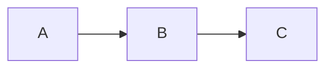

# Compatibilidade de Markdown entre Plataformas

> **Referência avançada de**: markdown-fundamentals
> **Tópico**: CommonMark vs GFM vs GitLab Markdown vs Bitbucket, Funcionalidades por Plataforma, Gotchas e Diferenças

---

## Overview

Não existe um único "padrão Markdown" universal. CommonMark é a especificação mais rigorosa, mas cada plataforma adiciona extensões próprias. Compreender as diferenças evita problemas de renderização quando um documento é visualizado em plataformas diferentes.

**Estratégia recomendada:** Escreva no CommonMark como base e adicione extensões apenas quando necessário e quando a plataforma de destino suporta.

---

## CommonMark — A Base

O CommonMark é uma especificação formal e não-ambígua de Markdown. Funciona como denominador comum entre plataformas.

### O que CommonMark Suporta

```markdown
<!-- Headings (ATX e Setext) -->
# Heading 1
## Heading 2
Heading Setext
-------------

<!-- Ênfase -->
*itálico* e **negrito** e ***ambos***

<!-- Listas -->
- não ordenada
1. ordenada

<!-- Links e Imagens -->
[link](url)


<!-- Blocos de código cercados -->
```linguagem
código
```

<!-- Código inline -->
`código inline`

<!-- Blockquotes -->
> citação

<!-- Quebra horizontal -->
---

<!-- Parágrafos e quebras de linha -->
```

### O que CommonMark NÃO Suporta

```markdown
<!-- Tabelas -->
<!-- Task Lists -->
<!-- Strikethrough (~~texto~~) -->
<!-- Autolinks sem angle brackets (https://url) -->
<!-- Footnotes -->
<!-- Diagramas Mermaid -->
<!-- Seções colapsáveis (details/summary) -->
<!-- Front matter YAML -->
<!-- Admonitions -->
```

---

## GitHub Flavored Markdown (GFM)

A extensão mais popular do CommonMark. Usada pelo GitHub e adotada (com variações) por muitas outras ferramentas.

### Extensões Específicas do GFM

```markdown
<!-- 1. Tabelas -->
| A | B |
|---|---|
| 1 | 2 |

<!-- 2. Task Lists -->
- [x] Concluído
- [ ] Pendente

<!-- 3. Strikethrough -->
~~texto riscado~~

<!-- 4. Autolinks -->
Visita https://github.com sem angle brackets.

<!-- 5. Fenced Code Blocks com linguagem (melhor suporte) -->
```python
print("GFM")
```

<!-- 6. Emoji shortcodes -->
:white_check_mark: :warning: :x:

<!-- 7. Menções e referências -->
@usuario
#123 (referência a issue)
usuario/repo#456
```

### Mermaid no GitHub

````markdown
<!-- Suportado nativamente desde 2022 -->

````

### Alertas/Admonitions no GitHub (2023+)

```markdown
<!-- Sintaxe nativa de alertas no GitHub -->
> [!NOTE]
> Informação adicional.

> [!TIP]
> Sugestão útil.

> [!WARNING]
> Atenção necessária.

> [!CAUTION]
> Cuidado com esta operação.

> [!IMPORTANT]
> Informação crítica.
```

**Nota:** Esta sintaxe de alertas é específica do GitHub e não funciona no GitLab ou outras plataformas.

---

## GitLab Markdown

Similar ao GFM mas com algumas diferenças e extensões adicionais.

### Semelhanças com GFM

```markdown
<!-- Tabelas: SIM -->
<!-- Task Lists: SIM -->
<!-- Strikethrough: SIM -->
<!-- Autolinks: SIM -->
<!-- Mermaid: SIM (nativo) -->
<!-- Emoji: SIM (shortcodes) -->
```

### Diferenças e Extensões Específicas do GitLab

```markdown
<!-- 1. Footnotes (nativo) -->
Texto com nota[^1].
[^1]: Definição da nota.

<!-- 2. Abreviações -->
Texto com HTML e CSS.
*[HTML]: HyperText Markup Language
*[CSS]: Cascading Style Sheets

<!-- 3. Definição de termos (Definition Lists) -->
Termo
:   Definição do termo

<!-- 4. Color labels (badges inline) -->
<!-- GitLab renderiza cores em labels de issues/MRs, não em Markdown puro -->

<!-- 5. Math (LaTeX) -->
Fórmula inline: $E = mc^2$
Fórmula em bloco:
$$
\sum_{i=1}^{n} i = \frac{n(n+1)}{2}
$$

<!-- 6. Alertas (sintaxe diferente do GitHub) -->
<!-- GitLab usa blockquotes formatados, não a sintaxe [!NOTE] do GitHub -->
```

### Gotcha: Heading Anchors

```markdown
<!-- GitHub: mantém acentos nos IDs -->
## Instalação
<!-- Âncora: #instalação -->

<!-- GitLab: remove acentos nos IDs -->
## Instalação
<!-- Âncora: #instalacao -->

<!-- Consequência: links com âncora para headings acentuados não são portáveis -->
<!-- SOLUÇÃO: usar IDs sem acentos quando possível, ou teste em ambas as plataformas -->
```

---

## Bitbucket Markdown

Suporte mais limitado comparado ao GitHub e GitLab.

### Suportado

```markdown
<!-- Básico CommonMark: SIM -->
<!-- Tabelas: SIM -->
<!-- Código cercado com linguagem: SIM -->
<!-- Links e imagens: SIM -->
<!-- Blockquotes: SIM -->
```

### NÃO Suportado ou com Comportamento Diferente

```markdown
<!-- Task Lists: não interativo -->
<!-- Mermaid: NÃO suportado nativamente -->
<!-- Footnotes: NÃO -->
<!-- Emoji shortcodes: limitado -->
<!-- Alertas/Admonitions: NÃO -->
<!-- Math/LaTeX: NÃO -->
```

---

## Sites de Documentação (MkDocs, Docusaurus, Jekyll, Hugo)

Estes geradores de site suportam extensões significativamente mais abrangentes que as plataformas de repositório.

### MkDocs + Python-Markdown

```markdown
<!-- Extensões populares do MkDocs: -->

<!-- 1. Admonitions com cores -->
!!! note "Título da Nota"
    Conteúdo da nota.

!!! warning
    Atenção necessária.

<!-- 2. Números de linha em código -->
```python linenums="1"
def main():
    pass
```

<!-- 3. Destaque de linhas -->
```python hl_lines="2"
def main():
    print("destacada")
```

<!-- 4. Tabs -->
=== "Python"
    ```python
    print("Python")
    ```

=== "JavaScript"
    ```javascript
    console.log("JS");
    ```

<!-- 5. Abreviações -->
<!-- 6. Footnotes -->
<!-- 7. Definition Lists -->
<!-- 8. Mermaid (via extensão mermaid2) -->
```

### Docusaurus

```markdown
<!-- Admonitions -->
:::tip Dica
Conteúdo da dica.
:::

:::warning Atenção
Conteúdo do aviso.
:::

<!-- Mermaid: suportado nativamente -->
<!-- Admonitions: sintaxe ::: nativa -->
<!-- Tabs via componentes MDX -->
```

---

## Tabela de Comparação Completa

| Recurso                    | CommonMark | GitHub (GFM) | GitLab | Bitbucket | MkDocs |
|:---------------------------|:----------:|:------------:|:------:|:---------:|:------:|
| Headings                   | Sim        | Sim          | Sim    | Sim       | Sim    |
| Ênfase (bold/italic)       | Sim        | Sim          | Sim    | Sim       | Sim    |
| Listas (ord/não-ord)       | Sim        | Sim          | Sim    | Sim       | Sim    |
| Links e Imagens            | Sim        | Sim          | Sim    | Sim       | Sim    |
| Código Cercado             | Sim        | Sim          | Sim    | Sim       | Sim    |
| Blockquotes                | Sim        | Sim          | Sim    | Sim       | Sim    |
| Tabelas                    | Não        | Sim          | Sim    | Sim       | Sim    |
| Task Lists                 | Não        | Sim          | Sim    | Parcial   | Parcial|
| Strikethrough              | Não        | Sim          | Sim    | Sim       | Sim    |
| Autolinks                  | Parcial    | Sim          | Sim    | Sim       | Sim    |
| Emoji Shortcodes           | Não        | Sim          | Sim    | Limitado  | Sim    |
| Footnotes                  | Não        | Sim          | Sim    | Não       | Sim    |
| Mermaid                    | Não        | Sim          | Sim    | Não       | Extensão|
| Alertas/Admonitions        | Não        | Sim (2023)   | Parcial| Não       | Sim    |
| Math/LaTeX                 | Não        | Sim          | Sim    | Não       | Extensão|
| Details/Summary (HTML)     | N/A        | Sim          | Sim    | Sim       | Sim    |
| Front Matter YAML          | Não        | Exibe        | Exibe  | Não       | Sim    |
| Definition Lists           | Não        | Não          | Sim    | Não       | Sim    |
| Abreviações                | Não        | Não          | Sim    | Não       | Sim    |

---

## Gotchas Comuns e Como Evitá-los

### 1. Alertas com Sintaxe Diferente

```markdown
<!-- GitHub usa: -->
> [!NOTE]
> Nota aqui.

<!-- GitLab/MkDocs usam blocos diferentes — não copie/cole entre plataformas -->
```

**Solução:** Use blockquotes simples com negrito quando precisa de compatibilidade:
```markdown
> **Nota:** Compatível com todas as plataformas.
```

### 2. Heading Anchors com Caracteres Especiais

```markdown
<!-- Diferentes plataformas geram IDs diferentes -->
## C++ Tutorial
<!-- GitHub: #c-tutorial -->
<!-- GitLab: #c-tutorial -->

## Instalação (Linux)
<!-- GitHub: #instalação-linux -->
<!-- GitLab: #instalacao-linux -->
```

**Solução:** Evite caracteres especiais em headings que serão usados como âncoras.

### 3. Indentação em Listas

```markdown
<!-- CommonMark: 2-3 espaços para sub-item -->
- Item
  - Sub-item (2 espaços)

<!-- Alguns renderizadores requerem 4 espaços -->
- Item
    - Sub-item (4 espaços)
```

**Solução:** Use 2 espaços como padrão; teste na plataforma de destino.

### 4. HTML em Markdown

```markdown
<!-- GitHub: HTML em blocos é renderizado -->
<div class="custom">Conteúdo</div>

<!-- CommonMark estrito: pode ignorar HTML em blocos -->
<!-- Teste sempre na plataforma de destino -->
```

### 5. Mermaid em Plataformas sem Suporte

```markdown
<!-- Se Mermaid não é suportado, o bloco aparece como texto puro -->
<!-- Alternativa: use imagens SVG pré-geradas -->
<!-- Ou use links para editores online: https://mermaid.live/ -->
```

---

## Estratégia de Compatibilidade Máxima

Para documentação que precisa funcionar em múltiplas plataformas:

```markdown
<!-- 1. Base: CommonMark estrito -->
<!-- 2. Extensões seguras (funcionam em GitHub + GitLab + MkDocs): -->
<!--    - Tabelas -->
<!--    - Task Lists -->
<!--    - Strikethrough -->
<!--    - Código cercado com linguagem -->
<!--    - Mermaid (evite em Bitbucket) -->

<!-- 3. EVITAR quando compatibilidade é prioridade: -->
<!--    - Alertas com sintaxe [!NOTE] (GitHub-only) -->
<!--    - Admonitions !!! (MkDocs-only) -->
<!--    - Definition Lists (GitLab/MkDocs-only) -->
<!--    - Math/LaTeX (nem GitHub nem Bitbucket nativamente) -->
<!--    - Footnotes com sintaxe [^1] (não no Bitbucket) -->
```

---

## Referências

- [CommonMark Spec](https://spec.commonmark.org/) — Especificação formal e não-ambígua
- [GitHub Flavored Markdown Spec](https://github.github.com/gfm/) — Especificação oficial do GFM
- [GitLab Markdown Reference](https://docs.gitlab.com/ee/user/markdown.html) — Documentação completa do GitLab
- [Bitbucket Markdown Guide](https://confluence.atlassian.com/bitbucketserver/markdown-formatting-help-915844700.html) — Guia de Markdown do Bitbucket
- [MkDocs Extensions](https://python-markdown.github.io/extensions/) — Extensões do Python-Markdown para MkDocs
