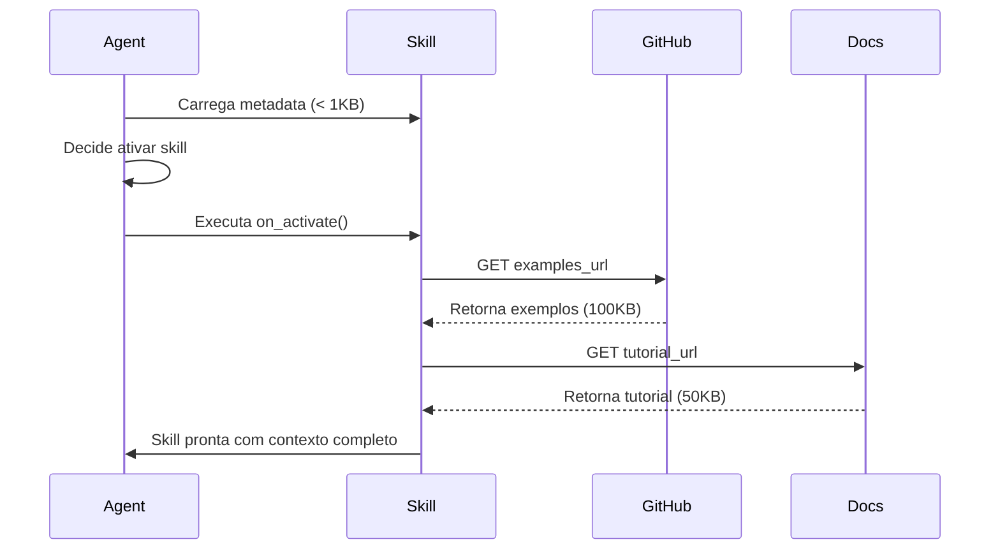

# Recursos JIT (Just-in-Time) - Best Practices

## Fonte
Extraído de: `docs/pesquisa/skill-generator-automatizado.md` (linhas 101-137)  
Agent Skills Spec: https://agentskills.io  
GitHub Gists Docs: https://docs.github.com/gists  
Acessado: 2026-02-05

## Resumo
Estratégia de carregamento sob demanda (JIT) de conteúdo complementar para skills, desacoplando núcleo leve da skill de sua massa de contexto (exemplos, referências, tutoriais). Reduz latência, consumo de memória e facilita manutenção colaborativa.

## Princípios Fundamentais

### 1. Desacoplamento Núcleo-Conteúdo (T0-HEFESTO-03)
Skill DEVE ser dividida em:
- **Núcleo leve** (< 500 linhas): Metadados + lógica mínima
- **Conteúdo complementar** (ilimitado): Exemplos, refs, tutoriais

**Benefício**: Carrega rápido, expande sob demanda

**Fonte**: Linha 103 research paper

### 2. Carregamento Lazy (Sob Demanda)
Conteúdo complementar é carregado:
- **Quando**: Agente decide ativar skill
- **Como**: Via HTTP/HTTPS (GitHub, Gist, docs site)
- **Modo**: Síncrono (bloqueante) ou assíncrono (background)

### 3. Origem Verificável
Conteúdo JIT DEVE ser:
- **Rastreável**: Link permanente para fonte
- **Verificável**: Commits assinados (GPG/SSH)
- **Versionado**: Git tags para estabilidade

**Fonte**: Linhas 123-124 research paper (segurança)

## Arquitetura JIT

### Componentes
```
SKILL (núcleo leve)
  ├─ metadata.yaml (jit_manifest)
  ├─ main.py (lógica)
  └─ on_activate() → fetch(jit_manifest.examples_url)
                   → fetch(jit_manifest.tutorial_url)
                   → fetch(jit_manifest.references_urls[])
```

### Fluxo de Execução


## JIT Manifest (metadata.yaml)

### Template
```yaml
jit_manifest:
  # Exemplos de uso (Gists ou repo)
  examples_url: https://gist.github.com/user/abc123
  
  # Tutorial passo-a-passo (HTML/Markdown)
  tutorial_url: https://docs.company.com/skills/my-skill/tutorial
  
  # Referências externas (array de URLs)
  references_urls:
    - https://www.postgresql.org/docs/16/
    - https://sqlite.org/lang.html
    - https://github.com/tobymao/sqlglot/wiki
  
  # Benchmarks/casos de teste (repo Git)
  benchmarks_url: https://github.com/user/my-skill-benchmarks
  
  # Configuração de carregamento
  load_strategy: lazy  # lazy | eager | on-demand
  cache_ttl: 3600      # Cache por 1 hora
  verify_signature: true  # Verificar commits assinados
```

### Exemplo Real
```yaml
name: generate-complex-sql
version: 1.0.0

jit_manifest:
  examples_url: https://gist.github.com/joaosilva/7f8a9b2c3d4e5f6a7b8c9d0e
  tutorial_url: https://sql-skills.readthedocs.io/en/latest/tutorial.html
  references_urls:
    - https://www.postgresql.org/docs/current/
    - https://dev.mysql.com/doc/refman/8.0/en/
    - https://www.sqlite.org/lang.html
  benchmarks_url: https://github.com/joaosilva/sql-skill-benchmarks/tree/v1.0.0
  load_strategy: on-demand
  cache_ttl: 7200
  verify_signature: true
```

## Tipos de Conteúdo JIT

### 1. Exemplos (examples/)
**Formato**: Código-fonte, SQL, JSON, YAML  
**Armazenamento**: GitHub Gists  
**Quando carregar**: Quando agente precisa de exemplo concreto

**GitHub Gist**:
```bash
# Criar gist público
gh gist create examples/basic-query.sql \
              examples/joins-example.sql \
              examples/window-functions.sql \
              --public \
              --desc "SQL Examples for generate-complex-sql skill"

# Output: https://gist.github.com/user/abc123def456
```

**Referência**: [GitHub Gists Docs](https://docs.github.com/gists)

### 2. Tutoriais (tutorials/)
**Formato**: HTML, Markdown  
**Armazenamento**: Site de docs (Read the Docs, GitHub Pages)  
**Quando carregar**: Quando usuário pede ajuda/onboarding

**Read the Docs**:
```yaml
# .readthedocs.yaml
version: 2
build:
  os: ubuntu-22.04
  tools:
    python: "3.11"
mkdocs:
  configuration: mkdocs.yml
```

### 3. Referências (references/)
**Formato**: Links para docs oficiais  
**Armazenamento**: Lista de URLs em metadata.yaml  
**Quando carregar**: Quando agente precisa de detalhes técnicos

**Exemplo**:
```yaml
references_urls:
  - https://www.postgresql.org/docs/16/sql-select.html
  - https://www.postgresql.org/docs/16/queries.html
  - https://github.com/tobymao/sqlglot/blob/main/README.md
```

### 4. Benchmarks (benchmarks/)
**Formato**: Scripts de teste, datasets  
**Armazenamento**: Repositório Git dedicado  
**Quando carregar**: Quando validar performance/correção

**Estrutura**:
```
benchmarks-repo/
├── README.md
├── tpch-queries.yaml      # TPC-H benchmark queries
├── performance-tests.py   # Testes de performance
├── datasets/
│   └── sample-data.sql
└── .github/
    └── workflows/
        └── run-benchmarks.yml
```

## Implementação

### Python (main.py)
```python
import yaml
import requests
from pathlib import Path
from typing import Dict, List

def load_metadata() -> Dict:
    """Carregar metadata.yaml"""
    with open('metadata.yaml', 'r') as f:
        return yaml.safe_load(f)

def fetch_jit_examples(url: str) -> List[str]:
    """Carregar exemplos via JIT"""
    response = requests.get(url, timeout=10)
    response.raise_for_status()
    
    # GitHub Gist retorna JSON
    if 'gist.github.com' in url:
        data = response.json()
        return [file['content'] for file in data['files'].values()]
    
    # URL direto para arquivo
    return [response.text]

def fetch_jit_references(urls: List[str]) -> List[Dict]:
    """Carregar referências externas"""
    references = []
    for url in urls:
        try:
            response = requests.head(url, timeout=5)
            references.append({
                'url': url,
                'status': response.status_code,
                'available': response.ok
            })
        except requests.RequestException:
            references.append({
                'url': url,
                'status': None,
                'available': False
            })
    return references

def on_skill_activate():
    """Hook executado quando skill é ativada"""
    metadata = load_metadata()
    jit = metadata.get('jit_manifest', {})
    
    # Carregar estratégia
    strategy = jit.get('load_strategy', 'lazy')
    
    if strategy == 'eager':
        # Carregar tudo imediatamente
        examples = fetch_jit_examples(jit['examples_url'])
        refs = fetch_jit_references(jit['references_urls'])
        return {'examples': examples, 'references': refs}
    
    elif strategy == 'lazy':
        # Retornar URLs, carregar depois
        return {
            'examples_url': jit['examples_url'],
            'references_urls': jit['references_urls']
        }
    
    else:  # on-demand
        # Não carregar nada, deixar agente decidir
        return jit

if __name__ == '__main__':
    context = on_skill_activate()
    print(f"Skill activated with context: {context}")
```

### JavaScript (main.js)
```javascript
const yaml = require('js-yaml');
const fs = require('fs');
const axios = require('axios');

async function loadMetadata() {
  const content = fs.readFileSync('metadata.yaml', 'utf8');
  return yaml.load(content);
}

async function fetchJITExamples(url) {
  const response = await axios.get(url, { timeout: 10000 });
  
  // GitHub Gist
  if (url.includes('gist.github.com')) {
    return Object.values(response.data.files).map(f => f.content);
  }
  
  // Direct file
  return [response.data];
}

async function onSkillActivate() {
  const metadata = await loadMetadata();
  const jit = metadata.jit_manifest || {};
  
  switch (jit.load_strategy) {
    case 'eager':
      const examples = await fetchJITExamples(jit.examples_url);
      return { examples };
    
    case 'lazy':
      return { examples_url: jit.examples_url };
    
    default:  // on-demand
      return jit;
  }
}

onSkillActivate().then(ctx => console.log('Context:', ctx));
```

## Estratégias de Carregamento

### Eager (Ansioso)
```yaml
load_strategy: eager
```
- **Quando**: Skill ativada, carrega TUDO imediatamente
- **Pros**: Contexto completo disponível
- **Cons**: Latência inicial alta
- **Use quando**: Skill precisa de todos os exemplos

### Lazy (Preguiçoso)
```yaml
load_strategy: lazy
```
- **Quando**: Skill ativada, retorna URLs, carrega depois
- **Pros**: Ativação rápida, carrega o que precisar
- **Cons**: Latência adicional ao acessar exemplos
- **Use quando**: Nem sempre precisa de exemplos

### On-Demand (Sob Demanda)
```yaml
load_strategy: on-demand
```
- **Quando**: Agente decide explicitamente carregar
- **Pros**: Máxima eficiência
- **Cons**: Requer lógica no agente
- **Use quando**: Skill complexa com muitos recursos

## Cache e Performance

### Cache Local
```python
import hashlib
from pathlib import Path

CACHE_DIR = Path.home() / '.hefesto' / 'jit-cache'

def get_cached_content(url: str, ttl: int = 3600) -> str | None:
    """Buscar conteúdo em cache local"""
    cache_key = hashlib.md5(url.encode()).hexdigest()
    cache_file = CACHE_DIR / f"{cache_key}.cache"
    
    if cache_file.exists():
        age = time.time() - cache_file.stat().st_mtime
        if age < ttl:
            return cache_file.read_text()
    
    return None

def cache_content(url: str, content: str):
    """Salvar conteúdo em cache"""
    CACHE_DIR.mkdir(parents=True, exist_ok=True)
    cache_key = hashlib.md5(url.encode()).hexdigest()
    cache_file = CACHE_DIR / f"{cache_key}.cache"
    cache_file.write_text(content)
```

### Cache HTTP (ETags)
```python
def fetch_with_etag(url: str, etag: str | None = None) -> tuple[str, str]:
    """Fetch com suporte a ETags"""
    headers = {}
    if etag:
        headers['If-None-Match'] = etag
    
    response = requests.get(url, headers=headers)
    
    if response.status_code == 304:  # Not Modified
        return None, etag  # Usar cache
    
    return response.text, response.headers.get('ETag')
```

## Segurança (T0-HEFESTO-11)

### Verificação de Assinatura
```bash
# Assinar commits (autor da skill)
git config user.signingkey <GPG_KEY_ID>
git commit -S -m "Add SQL examples"
git tag -s v1.0.0 -m "Release 1.0.0"
git push origin v1.0.0

# Verificar assinatura (consumidor da skill)
git verify-commit HEAD
git verify-tag v1.0.0
```

**Referências**:
- [Signing Commits](https://docs.github.com/authentication/managing-commit-signature-verification/signing-commits)
- [About Signature Verification](https://docs.github.com/authentication/managing-commit-signature-verification/about-commit-signature-verification)

### Whitelist de Origens
```yaml
jit_manifest:
  allowed_origins:
    - github.com
    - gist.github.com
    - readthedocs.io
    - company.com
  
  # Rejeitar outras origens
  reject_unknown: true
```

### Sanitização de Conteúdo
```python
import re

def sanitize_jit_content(content: str, content_type: str) -> str:
    """Sanitizar conteúdo carregado via JIT"""
    
    if content_type == 'sql':
        # Remover comandos perigosos
        dangerous = ['DROP', 'DELETE', 'TRUNCATE', 'ALTER', 'EXEC']
        for cmd in dangerous:
            if re.search(rf'\b{cmd}\b', content, re.IGNORECASE):
                raise SecurityError(f"Dangerous SQL command: {cmd}")
    
    elif content_type == 'python':
        # Remover imports perigosos
        dangerous = ['os.system', 'subprocess', 'eval', 'exec']
        for func in dangerous:
            if func in content:
                raise SecurityError(f"Dangerous Python function: {func}")
    
    return content
```

## Checklist JIT

### Obrigatório
- [ ] jit_manifest em metadata.yaml
- [ ] examples_url aponta para Gist ou repo
- [ ] references_urls são URLs públicas válidas
- [ ] load_strategy definida (eager/lazy/on-demand)
- [ ] cache_ttl especificado (segundos)

### Recomendado
- [ ] Commits assinados com GPG/SSH
- [ ] Tags Git para versionamento estável
- [ ] README em cada repo de benchmarks
- [ ] Whitelist de origens permitidas
- [ ] Sanitização de conteúdo carregado

### Opcional
- [ ] Tutorial hospedado em Read the Docs
- [ ] CI/CD para validar exemplos
- [ ] Monitoramento de disponibilidade de URLs
- [ ] Fallback para cache offline

## Anti-Patterns (Evitar)

### ❌ Incluir Tudo em SKILL.md
```markdown
# SKILL.md (2500 linhas) ← Viola T0-HEFESTO-03
Exemplo 1: ... (500 linhas)
Exemplo 2: ... (500 linhas)
...
```

### ❌ Links Quebrados
```yaml
examples_url: https://gist.github.com/user/deleted-gist
# → 404 Not Found
```

### ❌ Conteúdo Não Versionado
```yaml
examples_url: https://example.com/examples.zip
# → Sem garantia de estabilidade
```

### ❌ Origens Não Verificáveis
```yaml
examples_url: http://random-site.com/code.py
# → Sem HTTPS, sem assinatura, arriscado
```

## Relacionados
- [structure.md](structure.md) - Estrutura de skills
- [security.md](security.md) - Segurança
- [../mcp-protocol.md](../mcp-protocol.md) - MCP Protocol

## Referências
1. skill-generator-automatizado.md (linhas 101-137)
2. GitHub Gists: https://docs.github.com/gists
3. Signing Commits: https://docs.github.com/authentication/managing-commit-signature-verification
4. Jupybara [ACM DL] - Actionable AI assistants
5. Agent Skills: https://agentskills.io

---

**Best Practice** | Hefesto Knowledge Base | v1.0.0
